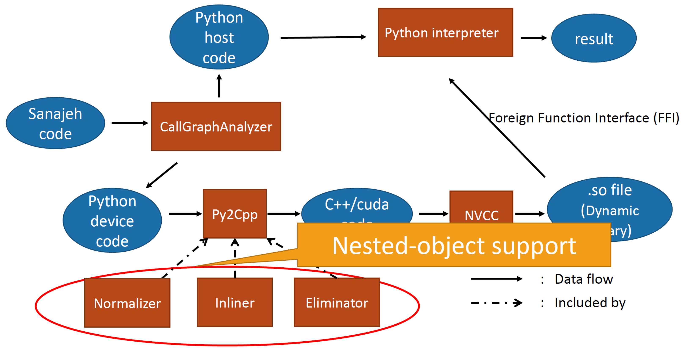

# Sanajeh
A DSL for GPGPU programming with Python objects.

# System Requirements

* DynaSOAr's system requirements
* Python 3.7 or later

# Design



Sanajeh allows the usage of SMMO paradigm on Python. Sanajeh analyzes the class definitions and uses an analyzer to separate *.cu* and *.h* definitions. From there, these are compiled into *.so* files. The separate *main* function runs the SMMO program by calling the *.so* files through FFI.

# Compilation

The examples are defined in `/examples`. Three working examples are `nbody`, `collision`, and `wator`. 

Compilation is executed as follows. Omitting the compile option will run the program.

````
python src/interface.py --c (compile) --r (render) --cpu (sequential) path/to/file.py
````